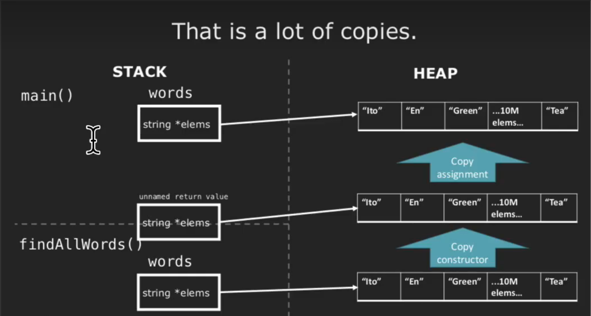

# Special Member Functions
* special member functions are usually automatically generated by the compiler
  * Default constructor: object created with no parameters, `T()`
  * Destructor: object destroyed when it is out of scope, `~T()`
  * Copy constructor: object is created as a copy of an existing object, `T(const T&)`
  * Copy assignment operator: existing object replaced as a copy of another existing object, `T& operator=(const T&)`
  * Move constructor: `T(T&&)`
  * Move assignment operator: `T& operator=(T&&)`
```cpp
Widget widgetOne;
Widget widgetTwo = widgetOne; // copy constructor

Widget widgetOne;
Widget widgetTwo;
widgetOne = widgetTwo; // copy assignment operator
```
* 默认的拷贝构造函数是浅拷贝
* deep copy: an object that is a complete, independent copy of the original.
  ```cpp
  // copy constructor
  // noexcept不抛出异常
  StringVector::StringVector(const StringVector& other) noexcept : logicalSize(other.logicalSize), allocatedSize(other.allocatedSize) {
    elems = new string[alocatedSize];
    std::copy(other.begin(), other.end(), begin());
  }

  // copy assignment
  StringVector& StringVector::operator=(const StringVector& other) {
    if (this != &other) {
        logicalSize = other.logicalSize;
        allocatedSize = other.allocatedAize;
        delete[] elems;
        elems = new string(allocatedSize);
        std::copy(other.begin(), other.end(), begin());
    }
    
    return *this;
  }
  ```
* we can set a special member function to delete removes its functionality.
```cpp
StringVector::StringVector(const StringVector& other) = delete;
StringVector& StringVector::operator=(const StringVector& other) = delete
```
* we can also keep the default copy constructor if we declare other constructors.
```cpp
StringVector::StringVector(const StringVector& other) = default;
```
* If you explicitly define (or delete) a copy constructor, copy assignment, or destructor, you should define (or delete) all three.
```cpp
vector<int> func(vector<int> vec0) { // vec0: copy constructor
    vector<int> vec1; // default constructor
    vector<int> vec2(3); // custom constructor
    vector<int> vec3{3}; // uniform initialization
    vector<int> vec4(); // function definition
    vector<int> vec5(vec2); // copy constructor
    vector<int> vec6{}; // uniform initialization
    vector<int> vec7{static_cast<int>(vec2.size() + vec6.size())}; // // uniform initialization
    vector<int> vec8 = vec2; // copy constructor
    vec8 = vec2; // copy assignment operator
    return vec8; // copy constructor
}
```
```cpp
int main() {
    StringVector words;
    words = findAllWords("words.txt");
}

StringVector findAllWords(const string& filename) {
    StringVector words;
    // read from filename using an ifstream
    return words;
}
```

```cpp
StrVector readNames(size_t size) {
    StrVector names(size, "Ito");
    return names;
}

int main() {
    StrVector name1 = readNames(54321234);
    StrVector name2;
    name2 = readNames(54321234);
}


// 特殊成员函数调用顺序
// fill constructor(readNames函数中)
// copy constructor(readNames函数返回值)
// destructor
// copy constructor(name1)
// desturctor(readNames返回值的临时变量)
// default constructor
// fill constructor(readNames函数中)
// copy constructor(readNames函数返回值)
// destructor
// copy assignment operator
// desturctor(readNames返回值的临时变量)
// desturctor(name1)
// desturctor(name2)
```