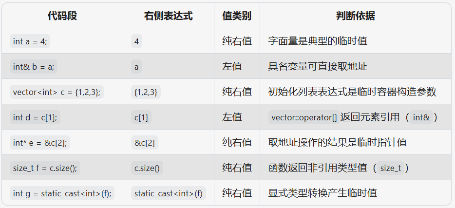

# Move Semantics
## Move vs. Copy Semantics
* make copies of persistent objects (e.g. variables), that might get used in the future
* move temporary objects (e.g. return value), since we no longer need to use them
## lvalues & rvalues
* lvalues and rvalues generalize the idea of “temporariness” in C++
* Generally speaking, lvalues have a definite address, rvalues do not!
* An lvalue can appear on either side of an `=`
* An rvalue can appear only right of an `=`
* An lvalue’s lifetime is until the end of scope
* An rvalue’s lifetime is until the end of line
* An lvalue is persistent
* An rvalue is temporary
```cpp
void foo(Photo pic) {
    Photo beReal = pic; // pic is lvalue
    Photo insta = takePhoto(); // takePhoto() is rvalue
}
```

* Avoid copying the memory of an lvalue: pass by lvalue reference
```cpp
void upload(Photo& pic);

int main() {
    Photo selfie = takePhoto();
    upload(selfie);
}
```
* Avoid copying the memory of an rvalue: pass by rvalue reference
```cpp
void upload(Photo&& pic);

int main() {
    upload(takePhoto());
}
```
* Compiler decides which version of `upload` to call depending on whether argument is lvalue or rvalue!
```cpp
int val = 2;
int* ptr = 0x02248837;
vector<int> v1{1, 2, 3};

auto& ptr2 = ptr; // ptr2 is an l-value reference
auto&& v4 = v1 + v2; // v4 is an r-value reference
auto& ptr3 = &val; // error, can't bind l-val ref to r-value
auto&& val2 = val; // error, can't bind r-val ref to l-val
const auto& ptr3 =  ptr + 5; // okay, can bind const l-val ref to r-val
```
## Move Semantics
* An object that is an l-value is not disposable(丢弃), so you can copy from, but definitely cannot move from.
* An object that is an r-value is disposable, so you can either copy or move from.
* move constructor (create new from existing r-value)
* move assignment (overwrite existing from existing r-value)
```cpp
// move constructor
Photo::Photo(Photo&& other) : width(other.width) , height(other.height), data(other.data)
{
    // other is temporary
    // Let’s steal its resources since we know it’s about to be gone!
    other.data = nullptr;
}

// move assignment operator
Photo& Photo::operator=(Photo&& other)
{
    // other is temporary
    // Let’s steal its resources since we know it’s about to be gone!
    delete[] data;

    width = other.width;
    height = other.height;
    data = other.data;
    other.data = nullptr;

    return *this;
}
```
## `std::move`
* `std::move` just type casts an lvalue to an rvalue
```cpp
class Photo {
public:
    Photo::Photo(Photo&& other) {
        keywords = std::move(other.keywords);
        // after move, other.keywords ends up in an unknown state
    }
private:
    std::vector<string> keywords;
};
```
```cpp
template <typename T>
void swap(T& a, T& b) {
    T c(std::move(a));
    a = std::move(b);
    b = std::move(c);
}
* Rule of Zero
    * If a class doesn’t manage memory (or another external resource), the compiler generated versions of the SMFs are sufficient!
* Rule of Three
    * If a class manages external resources, we must define copy assignment/constructor and destructor.
    * If you need any one of these, you need them all:
        * Destructor
        * Copy Assignment
        * Copy Constructor
* Rule of Five
    * If we defined copy constructor/assignment and destructor, we should also define move constructor/assignment.
    * This is not required, but our code will be slower as it involves unnecessary copying.
    * If you need any of these, you probably want them all:
        * Destructor
        * Copy Assignment
        * Copy Constructor
        * Move Assignment (Optional)
        * Move Constructor (Optional)
