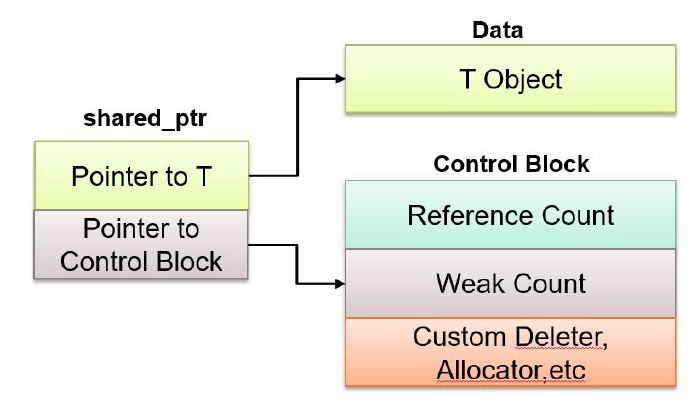

# RAII and Smart Pointers
## RAII (Resource Acquisition Is Initialization))
* Exceptions are a way of handling errors when they arise in code. Exceptions are “thrown”. However, we can write code that lets us handle exceptions so that we can continue in our code without necessarily erroring. We call this “catching” an exception.
```cpp
try {
    // code that we check for exceptions
}
catch([exception type] e1) { // "if"
    // behavior when we encounter an error
}
catch([other exception type] e2) { // "else if"
    // ...
}
catch { // the "else" statement
    // catch-all (haha)
}
```
* Functions can have four levels of exception safety:
  * Nothrow exception guarantee: absolutely does not throw exceptions (destructors, swap, move constructors).
  * Strong exception guarantee: rolled back to the state before function call.
  * Basic exception guarantee: program is in valid state after exception
  * No exception guarantee: resource leaks, memory corruption.
* It turns out that there are many resources that you need to release after acquiring.

|    | Acquire | Release |
| -- | -- | -- |
| Heap Memory | new | delete |
| Files | open | close |
| Locks | try_lock | unlock |
| Sockets | socket | close |
* RAII
    * All resources used by a class should be acquired in the constructor!
    * All resources that are used by a class should be released in the destructor.
    * example: `lock_guard`
```cpp
// 不符合RAII
void printFile() {
    ifstream input();
    input.open("hamlet.txt");

    string line;
    while (getline(input, line)) {
        cout << line << endl;
    }

    input.close();
}

// 符合RAII
void printFile() {
    ifstream input(hamlet.txt);

    string line;
    while (getline(input, line)) {
        cout << line << endl;
    }

    // no close call needed
    // stream destructor, releases access to file
}
```
```cpp
// 不符合RAII
void cleanDatabase(mutex& databaseLock, map<int, int>& database) {
    databaseLock.lock();

    // other threads will not modify database
    // modify the database
    // if exception thrown, mutex never unlocked

    databaseLock.unlock();
}

// 符合RAII
void cleanDatabase(mutex& databaseLock, map<int, int>& database) {
    lock_guard<mutex>(databaseLock);

    // other threads will not modify database
    // modify the database
    // if exception thrown, that's fine

    // no release call needed
    // lock always unlocked when function exits

}
```
## Smart Pointers
* `std::unique_ptr`
  * Uniquely owns its resource, can’t be copied
* `std::shared_ptr`
  * Can make copies, destructed when the underlying memory goes out of scope
  * Shared pointers get around our issue of trying to copy `std::unique_ptr`’s by not deallocating the underlying memory until all shared pointers go out of scope!
    
* `std::weak_ptr`
  * similar to a shared_ptr, but doesn't contribute to the reference count
used to deal with circular references of shared_ptr
  * A class of pointers designed to mitigate(减轻) circular dependencies
```cpp
// old pointer
void func() {
    Node *n = new Node;
    delete n;
}

// smart pointer
void func() {
    std::unique_ptr<Node> n = std::make_unique<Node>();

    std::unique_ptr<Node> copy = n; // error

    std::shared_ptr<Node> s = std::make_shared<Node>();
    std::weak_ptr<Node> w = s;
}
```
```cpp
// Both instance a of class A and instance b of class B are keeping a share pointer to each other.
// Therefore, they will never properly deallocate
// Here, in class B we are no longer storing a as a shared_ptr so it does not increase the reference count of a. 
// Therefore a can gracefully be deallocated, and therefore so can b
class B;

class A {
public:
    std::shared_ptr<B> ptr_to_b;
    ~A() {
        std::cout << "All of A's resources deallocated" << std::endl;
    }
};

class B {
public:
    std::shared_ptr<A> ptr_to_a; // std::weak_ptr<A> ptr_to_a;
    ~B() {
        std::cout << "All of B's resources deallocated" << std::endl;
    }
};

int main() {
    std::shared_ptr<A> shared_ptr_to_a = std::make_shared<A>();
    std::shared_ptr<B> shared_ptr_to_b = std::make_shared<B>();
    a->ptr_to_b = shared_ptr_to_b;
    b->ptr_to_a = shared_ptr_to_a;
    return 0;
}
```
## Building C++ projects
```
# g++ is the compiler, outputs binary to main
g++ main.cpp -o main 
./main
```
* `make` is a build system program that helps you compile
  * You can specify what compiler you want to use
  * Inorder to use `make` you need to have a Makefile
  ```
  # Compiler
  CXX = g++
  # Compiler flags
  CXXFLAGS = -std=c++20
  # Source files and target
  SRCS = $(wildcard *.cpp)
  TARGET = main
  # Default target
  all:
  $(CXX) $(CXXFLAGS) $(SRCS) -o $(TARGET)
  # Clean up
  clean:
  rm -f $(TARGET)
  ```
* `CMake` is a build system generator. So you can use `CMake` to generate Makefiles.
  ```
  # CMakeLists.txt
  cmake_minimum_required(VERSION 3.10)
  project(cs106l_classes)
  # This command tells CMAKE to set the C++ compiler to C++20
  set(CMAKE_CXX_STANDARD 20) 
  # This GLOB command is telling the CMAKE program to do a wildcard search for all files that have the pattern *.cpp
  file(GLOB SRC_FILES "*.cpp")
  # This command adds all of the source files of our program into the executable
  add_executable(main ${SRC_FILES})
  ```
  * To use `CMake`
    * You need to have a CMakeLists.txt file in your project’s root directory
    * Make a build folder (`mkdir build`) within your project!
    * Go into the build folder (`cd build`)
    * Run `cmake ..`
      * This command runs `cmake` using the CMakeLists.txt in your project’s root folder!
      * This generates a Makefile
    * Run `make`
    * Execute your program using `./main` as usual
