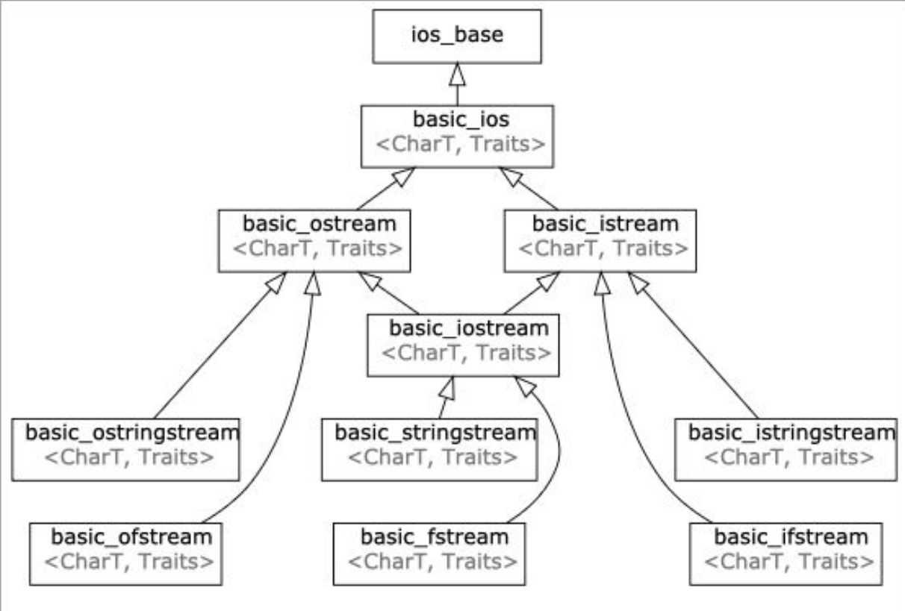
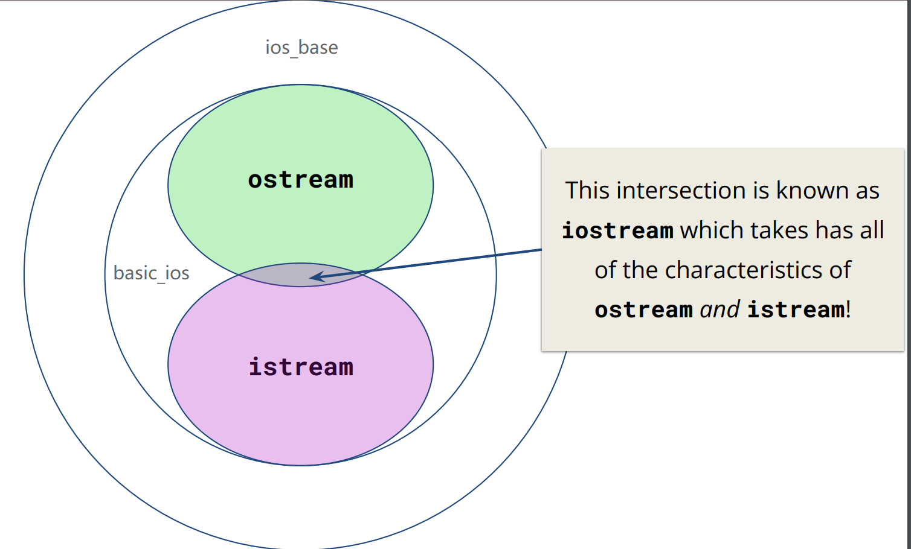
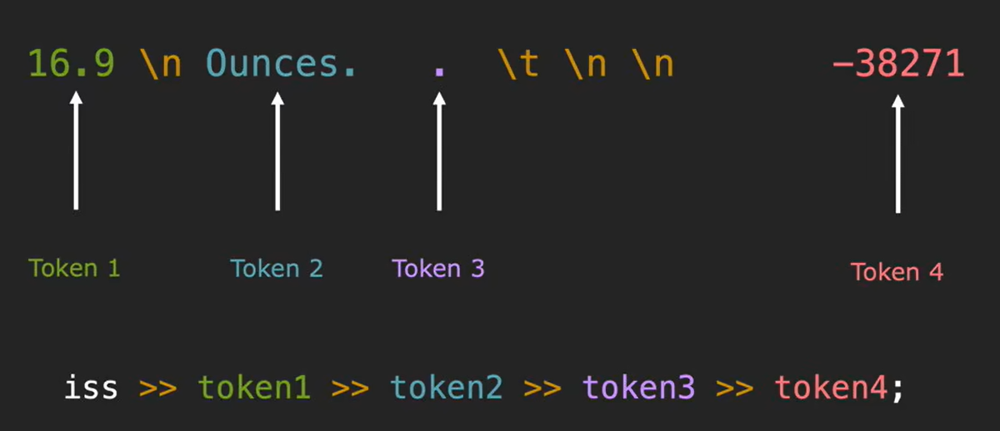
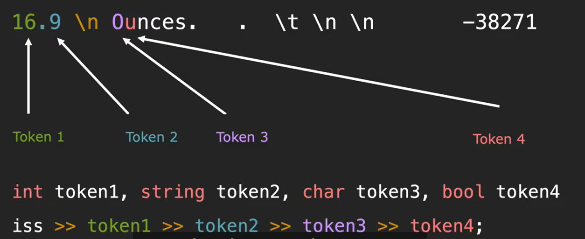
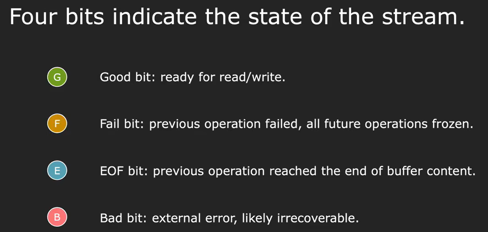

# Streams
A general input/output abstraction for C++.
```cpp
std::cout << "Hello, World" << std::endl;
// std::cout stream is an instance of std::ostream which represents the standard output stream

double pi;
std::cin >> pi;
// std::cin stream is an instance of std::istream which represents the standard input stream
```
## Streams and types

* Input streams
  * a way to read data from a source
    * are inherited from `std::istream`
    * ex. reading in something from the console(`std::cin`)
    * primary operator: `>>`
* Output streams
  * a way to write data to a destination
    * are inherited from `std::ostream`
    * ex. writing out something to the console(`std::cout`)
    * primary operator: `<<`


## stringstreams
* a way to treat strings as streams
* stringstreams are useful for use-cases that deal with mixing data types
```cpp
#include <iostream>
#include <sstream>

int main()
{
    std::string initial_quote = "Bjarne Stroustrup C makes it easy to shoot yourself in the foot";

    // create a stringstream
    std::stringstream ss(initial_quote); // or ss << initial_quote;

    // data destinations
    std::string first;
    std::string last;
    std::string language, extracted_quote;

    ss >> first >> last >> language >> extracted_quote; // the >> operator only reads until the next whitespace
    std::cout << first << " " << last << " said this: " << language << " " << extracted_quote << std::endl; // Bjarne Stroustrup said this: C makes

    return 0;
}
```
* `getline()` reads an input stream `is`, up until the `delim` char(default is `\n`) and stores it in some buffer `str`. `getline()` consumes the `delim` character. 
```cpp
istream& getline(istream& is, string& str, char delim)
```
```cpp
#include <iostream>
#include <sstream>

int main()
{
    std::string initial_quote = "Bjarne Stroustrup C makes it easy to shoot yourself in the foot";

    // create a stringstream
    std::stringstream ss(initial_quote);

    // data destinations
    std::string first;
    std::string last;
    std::string language, extracted_quote;

    ss >> first >> last >> language;
    std::getline(ss, extracted_quote); // getline不会丢弃前序的空格
    std::cout << first << " " << last << " said this: " << language << " " << extracted_quote << std::endl; // Bjarne Stroustrup said this: C  makes it easy to shoot yourself in the foot

    return 0;
}
```
## `ostringstream` and `istringstream`
```cpp
#include <iostream>
#include <sstream>

using namespace std;

int main() {
    // Constructors with initial text in the buffer
    ostringstream oss("Ito-En Green Tea");
    cout << oss.str() << endl; // Ito-En Green Tea

    oss << "16.9 Ounces";
    cout << oss.str() << endl; // 16.9 Ouncesn Tea

    // Can optionally provide modes such as ate(start at end)
    ostringstream oss2("Ito-En Green Tea", ostringstream::ate);
    cout << oss2.str() << endl; // Ito-En Green Tea

    oss2 << "16.9 Ounces";
    cout << oss2.str() << endl; // Ito-En Green Tea16.9 Ounces

    oss2 << 10; // convert 10 to string and insert into buffer
    cout << oss2.str() << endl; // Ito-En Green Tea16.9 Ounces10
}

```
```cpp
#include <iostream>
#include <sstream>

using namespace std;

int main() {
    istringstream iss("16.9 Ounces");

    double amount;
    string unit;

    iss >> amount; // 直到遇到空白字符
    iss >> unit;
    cout << "amount = " << amount << ", unit = " << unit << endl; // amount = 16.9, unit = Ounces
}

```



```cpp
int stringToInteger(const string& s) {
    istringstream iss(s);

    int result;
    iss >> result; // or if (!(iss >> result))
    if (iss.fail())
        throw domain_error("no valid int at beginning");

    char remain;
    iss >> remain;
    if (!iss.fail()) // or if (!iss.eof())
        throw domain_error("more than a single valid int");
        
    return result;
}

void printStateBits(const istream& iss) {
    cout << "State bits: ";
    cout << (iss.good() ? "G" : "-");
    cout << (iss.fail() ? "F" : "-");
    cout << (iss.eof() ? "E" : "-");
    cout << (iss.bad() ? "B" : "-");
    cout << endl;
}
```
```cpp
int getInteger() {
    while (true) {
        string line;
        int result;
        char trash;

        if (!getline(cin, line))
            throw domain_error("error");
        istringstream iss(line);
        if ((iss >> result) && !(iss >> trash))
            return result;
    }
}
```
```cpp
int main() {
    istringstream iss("16.9\n 24");
    double val;
    string line;
    iss >> val; // val = 16.9
    // iss.ignore(); // 跳过一个字符
    getline(iss, line); // line = "", getline不会跳过空白字符
    getline(iss, line); // line = " 24"

    return 0;
}
```
## `cout` and `cin`
### output streams
* character in output streams are stored in an intermediary(过渡的) buffer before being flushed to the destination.
* contents in buffer not shown on external source until an explicit flush occurs(`std::flush` or `std::endl`) or buffer is full.
* `std::endl`插入换行符并刷新缓冲区，适用于需要立即输出的场景。
* `'\n'`仅插入换行符，不刷新缓冲区，适用于大多数普通场景，性能更高。
* `cerr` used to output errors(unbuffered).
* `clog` used for non-critical event logging(buffered).
### output file streams
* output file streams have a type`std::ofstream`
* a way to write data to a file
  * use `<<` to send to the file
```cpp
#include <iostream>
#include <fstream>

int main()
{
    std::ofstream ofs("hello.txt"); // creates an output file stream to the file hello.txt
    if (ofs.is_open()) {
        ofs << "Hello CS106L!" << '\n';
    }
    ofs.close();
    ofs << "this will not get written";
    ofs.open("hello.txt");
    ofs << "this will though! It’s open again";
    ofs.close();
    ofs.open("hello.txt", std::ios::app); // flag specifies you want to append, not truncate
    ofs << "this will though! It’s open again";
    return 0;
}

```
### input file streams
```cpp
#include <iostream>
#include <fstream>

int main()
{
    std::ifstream ifs("hello.txt"); // 会在析构时自动close
    if (ifs.is_open()) {
        std::string line;
        std::getline(ifs, line);
        std::cout << "Read from the file: " << line << '\n'; // 读第一行
    }
    if (ifs.is_open()) {
        std::string lineTwo;
        std::getline(ifs, lineTwo);
        std::cout << "Read from the file: " << lineTwo << '\n'; // 读第二行
    }
    return 0;
}

```
### input streams
* input streams have the type `std::istream`
* `std::cin` is buffered
* 当`cin` 的buffer为空时，`cin`会等待用户输入
* an input operations will flush `cout`
```cpp
#include <iostream>

int main()
{
    double pi;
    double tao = 5;
    std::string name;
    std::cin >> pi;
    std::getline(std::cin, name);
    std::getline(std::cin, name);
    std::cin >> tao;
    std::cout << "my name is : " << name << ", tao is : " << tao << ", pi is : " << pi << '\n';

    return 0;
}

``` 
* `cin` 会跳过前序空白字符，`getline` 不会跳过
* `cin` 会将结尾的空白字符留在buffer，`getline` 不会将结尾的空白字符留在buffer
* `cin` skips past the initial whitespace and reads up to a whitespace. Trash in the buffer will make `cin` not prompt the user for input at the right time. When `cin` fails, all future `cin` operations fail too.


