# Containers
STL: Standard Template Library
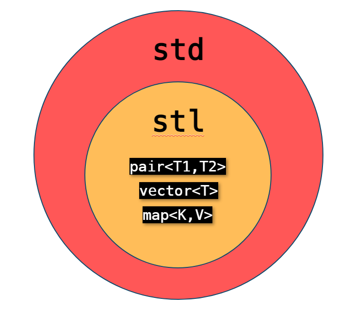
## Sequence Containers
Sequence containers are linear collections of elements.
### `std::vector<T>`
| Expression   | Result |
|----------|----------|
| `std::vector<T> v` | Creates an empty vector |
| `std::vector<T> v(n)` | Creates a vector with `n` copies of the default value of type `T` |
| `std::vector<T> v(n, e)` | Creates a vector with `n` copies of value `e` |
| `v.push_back(e)` | Appends `e` to the end of `v` |
| `v.pop_back()` | Removes the last element of `v`, which must not be empty. Note: This method does not return the element, it merely removes it |
| `v.empty()` | Returns whether `v` is empty |
| `T e = v[i]` or `v[i] = e` | Reads or writes to the element at index `i`. Does not perform bounds checking |
| `T e = v.at(i)` or `v.at(i) = e` | Reads or writes to the element at index `i`. Throws an error if `i` is out of bounds |
| `v.clear()` | Empties `v` |

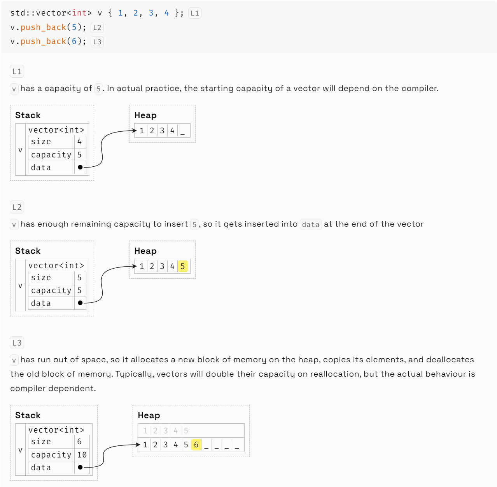
### `std::deque<T>`
An `std::deque<T>` (pronounced "deck") represents a double-ended queue of elements that supports efficient insertion/removal at both the front and back of the container.
| Expression   | Result |
|----------|----------|
| `d.push_front(e)` | Appends `e` to the front of the `d` |
| `d.pop_front()` | Removes the first element of `d`, which must not be empty. Note: This method does not return the element, it merely removes it |

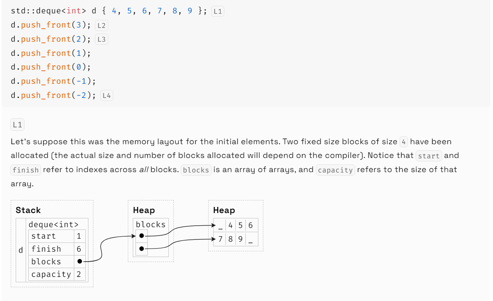
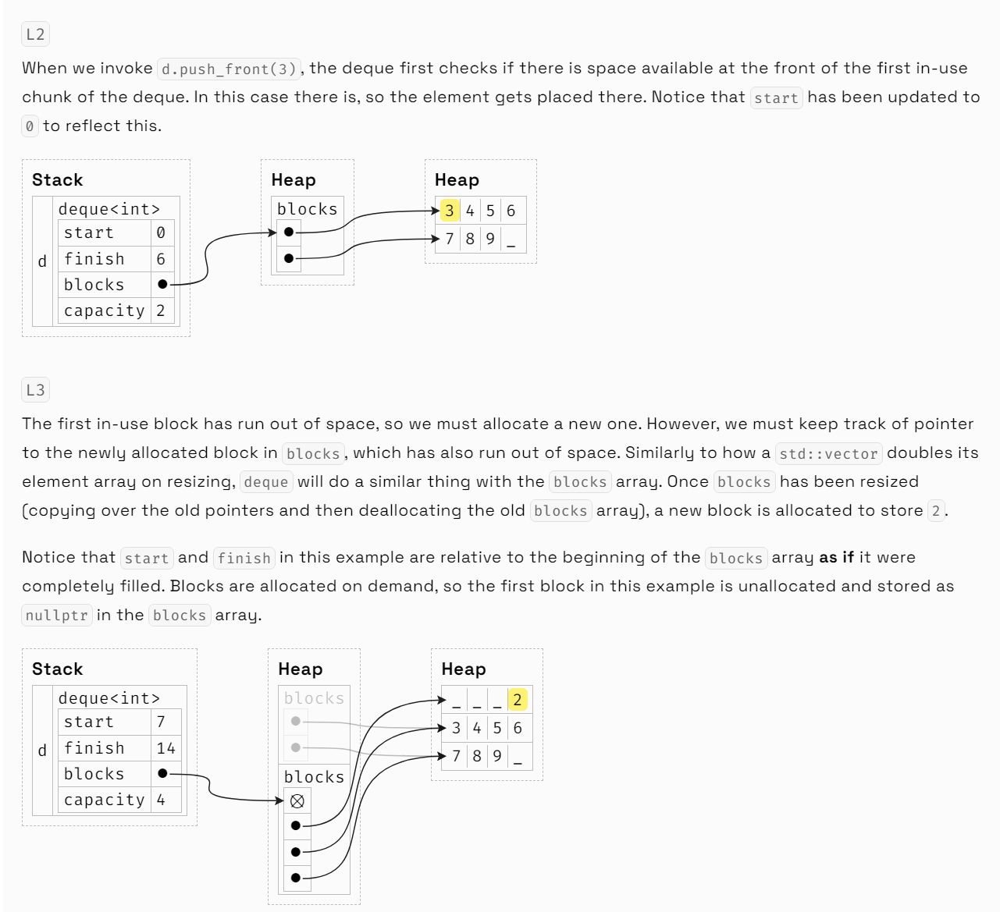
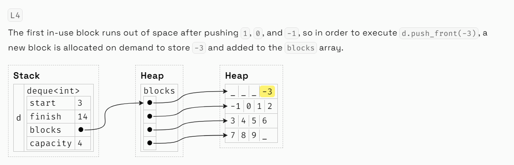
## Associative Containers
Associative containers are collections that organize their elements in terms of unique keys.
### Ordered Containers
```cpp
std::map<std::string, std::string> famous {
  { "Bjarne", "Stroustrup" },
  { "Herb", "Sutter" },
  { "Alexander", "Stepanov" }
};

for (const auto& [key, value] : famous) {
  std::cout << key << ": " << value << std::endl;
}

// Output (notice keys are sorted):
//  Alexander: Stepanov
//  Bjarne: Stroustrup
//  Herb: Sutter
```
To use an `std::map<K, V>` or a `std::set<T>`, `K` or `T` must have an `operator<`. If a type `K` or `T` lacks an `operator<`, you can still use it with a map or set as long as you can define one, which can be done in a number of ways:

* Define an `operator<`
```cpp
bool operator<(const MyType& a, const MyType& b) {
    // Return true if `a` is less than `b`
}
```
* Define a functor
```cpp
struct Less {
    bool operator()(const MyType& a, const MyType& b) {
        // Return true if `a` is less than `b`
    }
}

std::map<MyType, double, Less> my_map;
std::set<MyType, Less> my_set;
```
* Use a lambda function
```cpp
auto comp = [](const MyType& a, const MyType& b){
    // Return true if `a` is less than `b`
};

std::map<MyType, double, decltype(comp)> my_map(comp);
std::set<MyType, decltype(comp)> my_set(comp);
```
#### `std::map<K, V>`
| Expression   | Result |
|----------|----------|
| `std::map<K, V> m` | Creates an empty map |
| `std::map<K, V> m { { k1, v1 } ...}` | Uniform initializes a map with key-value pairs `{k1, v1}`, `{k2, v2}`, etc |
| `auto v = m[k]` | Gets the value for a key `k`. If `k` is not in the map, it will be inserted with the default value for `V` |
| `m[k] = v` | Sets or updates the value for a key `k` |
| `auto v = m.at(k)` | Gets the value for a key `k`. Will throw an error if `k` is not present in the map |
| `m.insert({ k, v })` or `m.insert(p)` | Inserts an `std::pair p` (or the equivalent uniformly initialized pair using `k` and `v`) representing a key-value pair into the map if it doesn't already exist |
| `m.erase(k)` | Removes the key `k` from the map. `k` does not need to be present in the map |
| `if (m.count(k))` or `if (m.contains(k))` | Checks if `k` is in the map(底层实现为`find(m.begin(), m.end(), k)`) |
| `m.empty()` | Checks if `m` is empty |

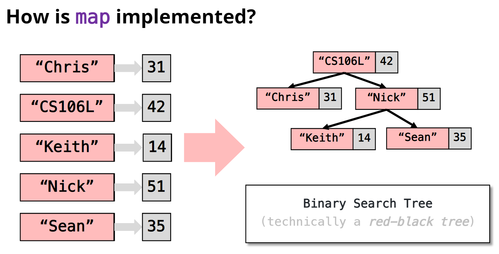
#### `std::set<T>`
A `set` is the standard way of storing a collection of unique elements in C++.
| Expression   | Result |
|----------|----------|
| `std::set<T> s` | Creates an empty set |
| `s.insert(e)` | Adds `e` to `s`. Calling `insert(e)` more than once has the same effect as calling it once |
| `s.erase(e)` | Removes `e` from `s`. `e` does not need to be `s` |
| `if (s.count(e))` or `if (s.contains(e))` | Checks if `e` is in the set |
| `s.empty()` | Checks if `s` is empty |

* `std::set` is an `std::map` without values.
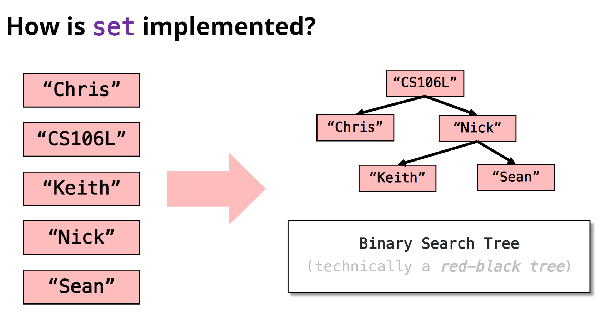
#### `std::multimap`
* `std::multimap` is a map that permits multiple entries with the same key.
* `std::multimap` doesn't have `[]` operator. Instead, add elements by calling `.insert` on a key value `std::pair`.
```cpp
std::multimap<int, int> myMMap;
myMMap.insert(make_pair(3, 3));
myMMap.insert({3, 12});
cout << myMMap.count(3) << endl; // 2
```
### Unordered Containers
`std::unordered_map<K, V>`and `std::unordered_set<T>`底层实现为hash table.
```cpp
// 自定义底层hash fuction
// 法一
template<>
struct std::hash<MyType>
{
  std::size_t operator()(const MyType& o) const noexcept
  {
    // Calculate and return the hash of `o`...
  }
};

std::unordered_map<MyType, std::string> my_map;

// 法二
struct MyHash {
  std::size_t operator()(const MyType& o) const noexcept
  {
    // Calculate and return the hash of `o`...
  }
};

std::unordered_map<MyType, std::string, MyHash> my_map;

// 法三
auto hash = [](const MyType& o) {
  // Calculate and return the hash of `o`...
};

/* The first number (10) is the starting number of buckets!
 * See the behind the scenes section for more information about buckets. */
std::unordered_map<MyType, std::string, decltype(hash)> my_map(10, hash);
std::unordered_set<MyType, decltype(hash)> my_set(10, hash);
```
```cpp
// 自定义equlity function
// 法一
bool operator==(const MyType& a, const MyType& b) {
    // Return true if `a` equals `b`
}

// 法二
struct Equal {
    bool operator()(const MyType& a, const MyType& b) {
        // Return true if `a` equals `b`
    }
}

std::unordered_map<MyType, double, std::hash<MyType>, Equal> my_map;
std::unordered_set<MyType, std::hash<MyType>, Equal> my_set;

// 法三
auto equals = [](const MyType& a, const MyType& b){
    // Return true if `a` equals `b`
};

std::unordered_map<MyType, double, std::hash<MyType>, decltype(equals)> my_map(10, {}, equals);
std::unordered_set<MyType, std::hash<MyType>, decltype(equals)> my_set(10, {}, equals);
```
#### `std::unordered_map<K, V>` and `std::unordered_set<T>`
* `unordered_map` is an accelerated version of `map` that allows looking up the value for a key in constant time, at the cost of using additional memory.
* `unordered_set` is an accelerated version of `set` that allows checking set-membership in constant time.

| Expression  | Result |
|----------|----------|
| `m.load_factor()` | Returns the current load factor of the map, `n` mappings and `b` buckets will have `n / b` load factor |
| `m.max_load_factor(lf)` | Sets the maximum allowed load factor to `lf`, default set to 1 |
| `m.rehash(b)` | Ensures `m` has at least `b` buckets and reassigns elements to buckets given the new bucket count |

* `unordered_map` stores a collection of `n` bucket of pairs.
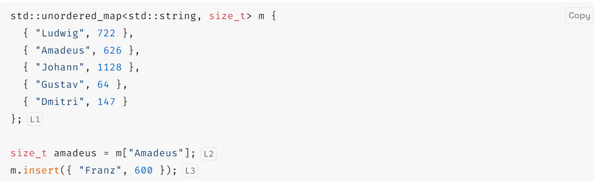
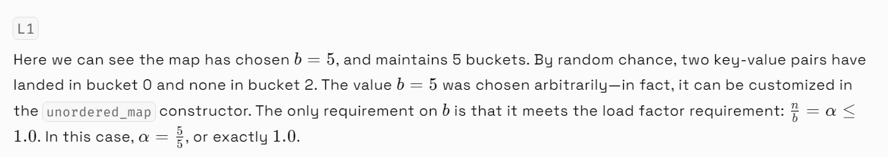
<div style="display: flex; justify-content: space-between;">
  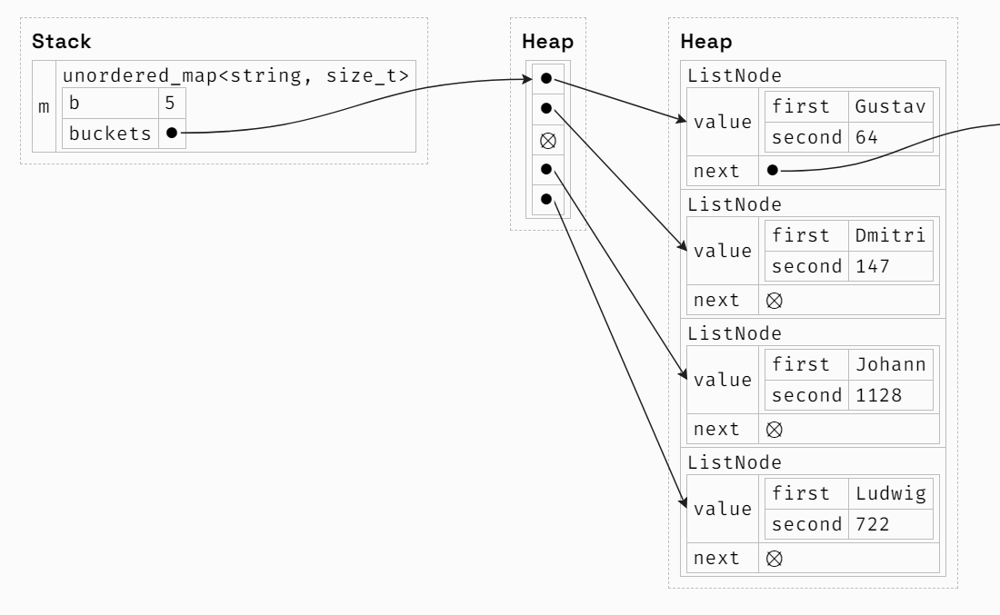
  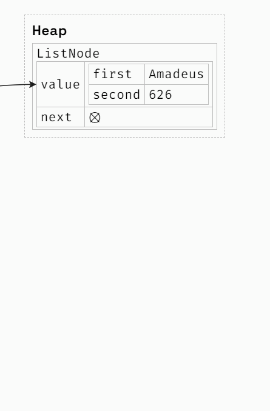
</div>

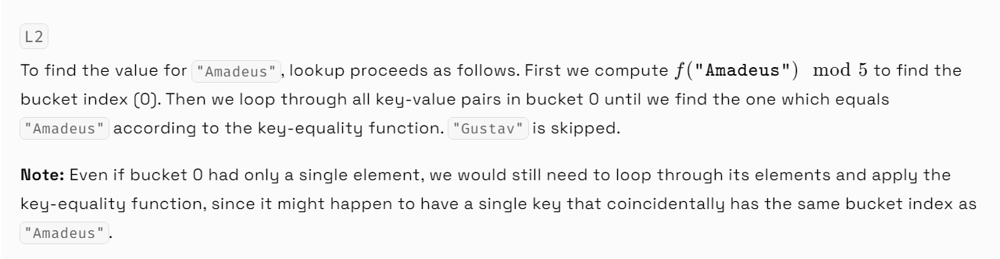
<div style="display: flex; justify-content: space-between;">
  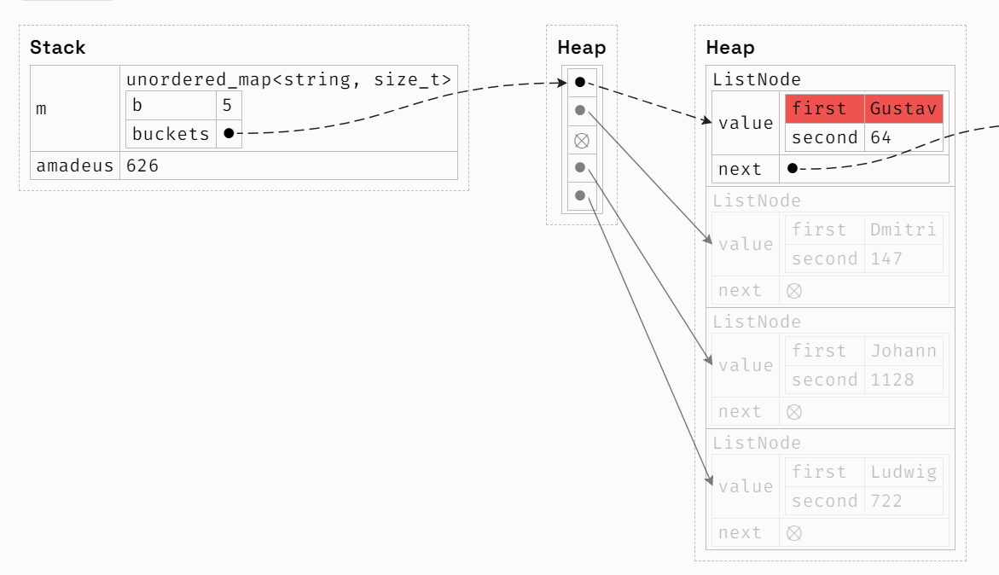
  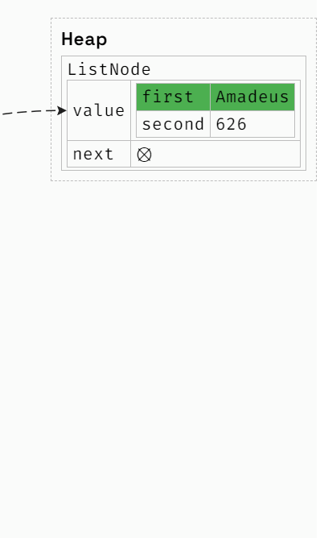
</div>

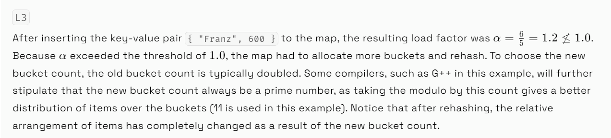
<div style="display: flex; justify-content: space-between;">
  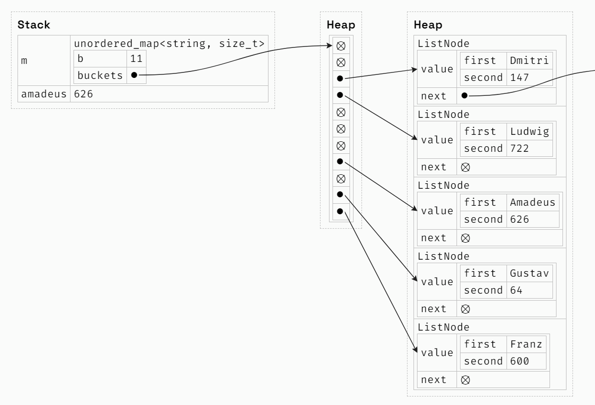
  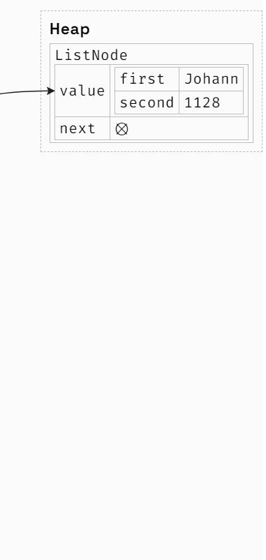
</div>

## Container Adaptors
* `stack` just limit the functionality of a `vector`/`deque` to only allow `push_back` and `pop_back`
* `queue` just limit the functionality of a `deque` to only allow `push_back` and `pop_front`
* plus only allow access to top element