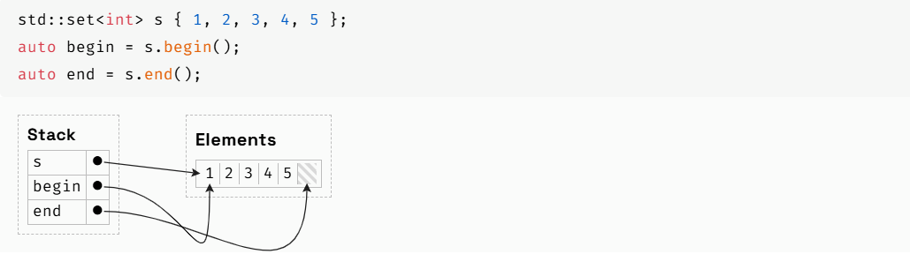
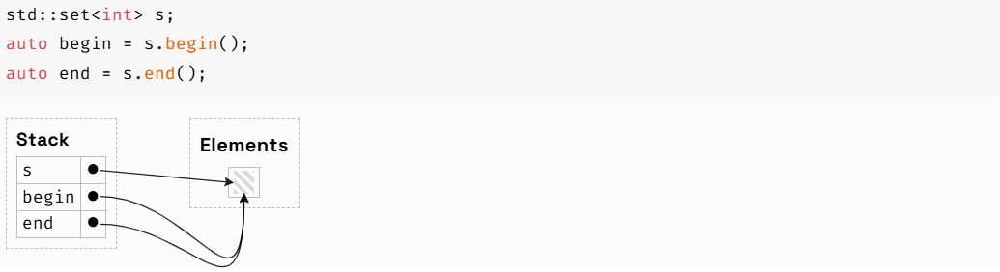
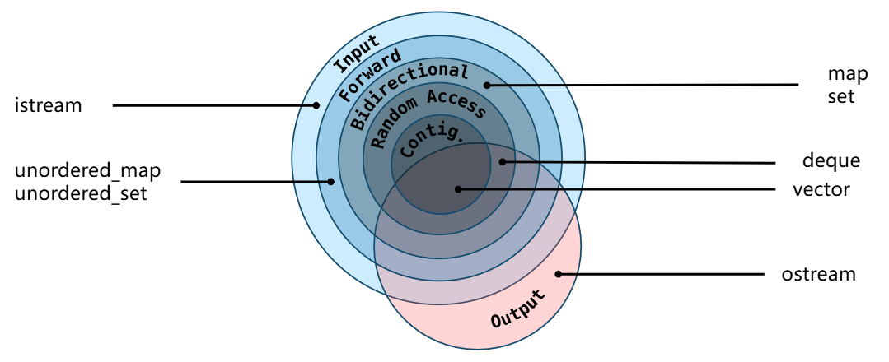
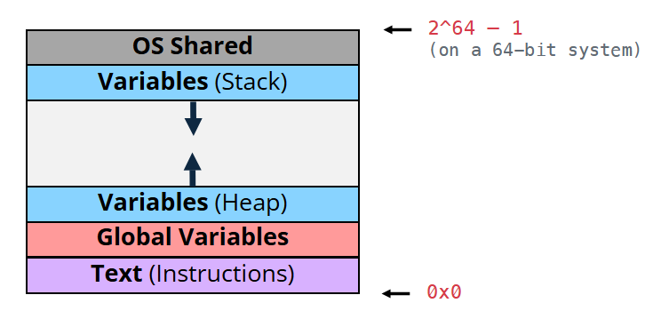
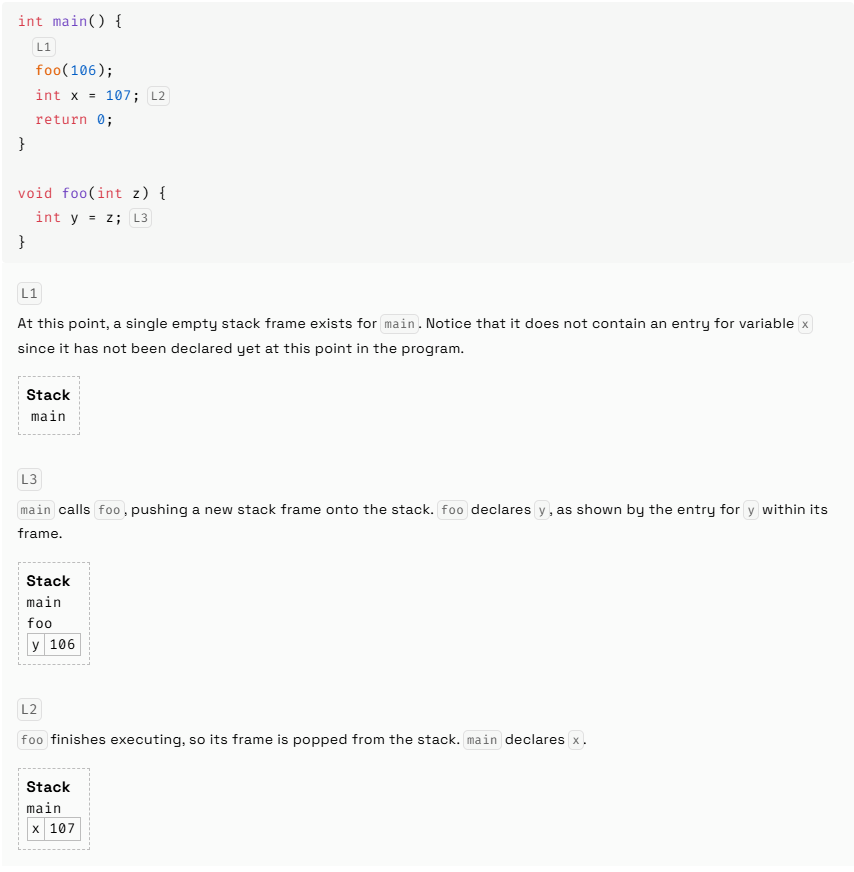
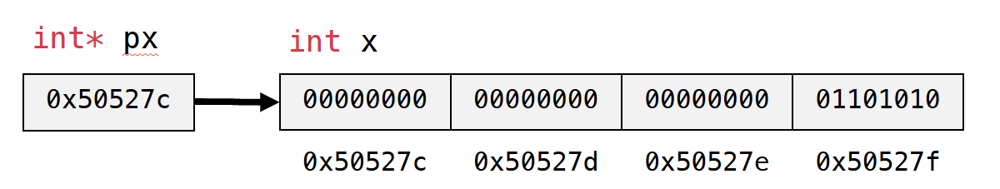
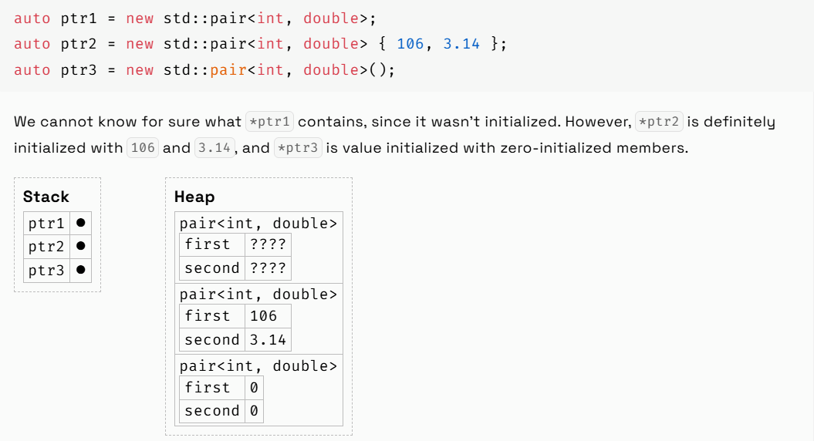
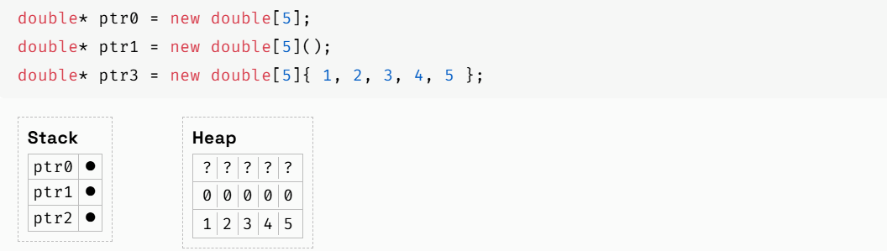

# Iterators
* Iterators allow iteration over any container, whether it is ordered or not.
* Iterators let us view a non-linear collection in a linear manner.
## Iterator Basics
### Container Interface
| Container Method | Description |
|------------------|-------------|
| `std::begin(c)` or `c.begin()` | Gets an iterator to the first element of a container |
| `std::end(c)` or `c.end()` | Gets an iterator to the past-the-end element of a container |



* an empty container has `c.begin()` and `c.end()` pointing to the same (non-existent) element
### Iterator Interface
| Iterator Method | Description |
|------------------|-------------|
| `auto it = c.begin()` | Copy Construction: `operator=` creates a copy of an existing iterator that points to the same element |
| `++it` or `it++` | Increment: `operator++` moves the iterator forward onto the next element |
| `it == c.end()` | Comparison: `operator==` determines whether two iterators point to the same element |
| `*it` | Indirection: `operator*` returns a reference to the underlying element. Whether this reference can be read or written to depends on whether it is an input or an output iterator |
```cpp
// When you write
for (auto elem : s) {
    cout << elem;
}

// It's actually this
auto b = s.begin();
auto e = s.end();
for (auto it = b; it != e; ++it) {
    auto elem = *it;
    cout << elem;
}
```
```cpp
const vector<int>::iterator itr = v.begin();
*itr = 5; // OK
++itr; // error

vector<int>::const_iterator itr = v.begin();
*itr = 5; // error
++itr; // OK
```
### Iterator Types
* Given a container type `C`, its iterator type will be `C::iterator`. Under the hood, the iterator types are implemented by the compiler internally for each data structure and type-aliased with a `using` definition inside of the container class.
```cpp
template <typename T>
class std::vector {
public:
  using iterator = T*;
};
```
```cpp
// prefix ++it
// increments it and returns a reference to same subject
Iterator& operator++(int);

// postfix it++
// increments it and returns a copy of the old value
Iterator operator++();
```
## Iterator Categories

* Input
  * An iterator is an input iterator if it supports reading the pointed to element
    ```cpp
    auto elem = *it;
    ```
* Output
  * An iterator is an output iterator if it supports overwriting the pointed to element via `operator=`
    ```cpp
    *it = elem;
    ```
  * 反例：Some container iterators will not be output if modifying their element would require restructuring the container. For example, changing the key of an element in a `std::map` might change where that element lives in its binary-search tree, so `std::map<K, V>::iterator` is not output.
* Forward
  * Forward iterators guarantee that multiple passes are valid. That is, given iterators `a` and `b` which point to the same element (`a == b`), it must hold that `++a == ++b`
  * 反例：streams
* Bidirectional
  * Bidirectional iterators are a kind of forward iterator that can be moved backwards as well as forwards.
    ```cpp
    --it;
    ```
  * A container's iterators will be bidirectional if there is some way to identify the previous element. This may be the case if the container is sequential (like a `vector`) or its elements are sorted (like a `std::map`).
* Random Access
  * A random-access iterator is a bidirectional iterator that supports jumping forwards or backwards multiple elements at a time.
  ```cpp
  std::vector<int> v { 1, 2, 3 };
  auto it = v.begin();
  auto elem = it[2];      // Same as *(it + 2)
  ```
* Contiguous
  * Contiguous iterators are a subset of random-access iterators that further stipulate(规定) that their elements are stored contiguously in memory.
  * For example, an `std::deque` is random-access, but not contiguous.
### Iterator Flavors
| Container Method | Description |
| ---------------- | ----------- |
| `std::cbegin(c)` or `c.cbegin()` | Gets a `const_iterator` to the first element of a container |
| `std::cend(c)` or `c.cend()` | 	Gets a `const_iterator` to the past-the-end element of a container |
| `std::rbegin(c)` or `c.rbegin()` | Gets an iterator to the first element in the container's reversed sequence. Dereferencing this iterator yields the last element in the container's ordinary (unreversed) sequence. |
| `std::rend(c)` or `c.rend()` | Gets an iterator to the past-the-end element in the container's reversed sequence. It is invalid to dereference this iterator—conceptually, it points to a non-existent element one before the first element in the container's ordinary (unreversed) sequence. |
| `std::crbegin(c)` or `c.crbegin()` | Returns the `const-iterator `version of `rbegin()` |
| `std::crend(c)` or `c.crend()` | Returns the `const-iterator` version of `rend()` |

# Pointers and Memory
* An iterator points to a container element. A pointer points to any object.
## Memory Basics


| Region   | Description |
|----------|----------|
| Shared Memory    | Memory reserved by the operating system that is shared with the program to allow, for example, communication between the current process and the operating system and/or other processes   |
| Stack    | Stores function calls, local variables, and control flow information, growing and shrinking automatically as functions execute   |
| Heap | Stores dynamically allocated objects, where objects persist beyond function calls and require explicit management by the programmer |
| Global Variables | Variables declared outside of a function live here |
| Instructions | Also called the text segment. This is the process's code being currently executed: raw machine code emitted by the compiler lives here |
* stack
  * the stack actually grows downward in memory(向下增长)
  * 栈中存放的数据大小必须在编译时期就确定（C语言stack中array的大小可以在运行期确定，C++不可以）
  
  * On most systems, the default size of the stack will range from 1-8 MB. On some embedded systems, the stack can be even more restricted, as small as a few KB. On Unix machines (like Linux and MacOS), running `ulimit -s` will print the size of the stack in KB.
* heap
  * heap允许在运行时分配内存
* heap比stack大，heap比stack慢
### Pointers
* the address of an object is the location of its lowest byte.
* a pointer is the address of a variable.

  ```cpp
  int x = 106;
  int *px = &x;
  // int* means px is a pointer to an int
  // & is the address of operator

  cout << x << endl; // 106
  cout << *px << endl; // 106
  cout << px << endl; // x的地址 0x50527c

  *x_ptr = 107; // x被修改为107
  ```
* On 64-bit systems, the size of a pointer will always be 64 bits (8 bytes). On 32-bit systems, a pointer will take up 32 bits (4 bytes).
```cpp
std::pair<double, double> my_pair { 10, 20 };
auto* ptr = &my_pair; ‌  ‌
double second = ptr->second; // Same as (*ptr).second
```
```cpp
int x = 106;
int y = 107;

const int* ptr = &x;
// *ptr = 107; // Not allowed, ptr points to const int
ptr = &y; // However, we can change where ptr points to
```
|   | non-const Pointee | const Pointee |
|----------|----------|----------|
| non-const Pointer | T* | const T* or T const* |
| const Pointer | T* const | const T* const or T const* const |
* `nullptr` which represents a pointer to no object. `nullptr` has a special type, `nullptr_t`. The only instance of `nullptr_t` is `nullptr`, and it automatically converts into an instance of any pointer type. You cannot dereference a `nullptr` as it doesn't point to any object.
```cpp
T* ptr = new T;

delete ptr;
// delete nullptr is valid
```

```cpp
T* ptr = new T[n];
delete[] ptr;
```

```cpp
int* arr = new int[4]();
int* ptr_to_2nd = arr + 1; // 指向数组的第二个元素
int* ptr_to_3rd = arr + 2; // 指向数组的第三个元素

int& elem1 = *(arr + 2);
int& elem2 = arr[2];
```
* Under the hood, the compiler treats references just like pointers. One important difference, however, is that references cannot be rebound.
* References are not allowed to be nullptr—they must always point to an object.
```cpp
std::pair<double, double> p { 2.72, 3.14 };

std::pair<double, double>* ptr = &p;
std::pair<double, double>& ref = p;

std::cout << ptr->first << "\n";
std::cout << ref.first << "\n";
```

