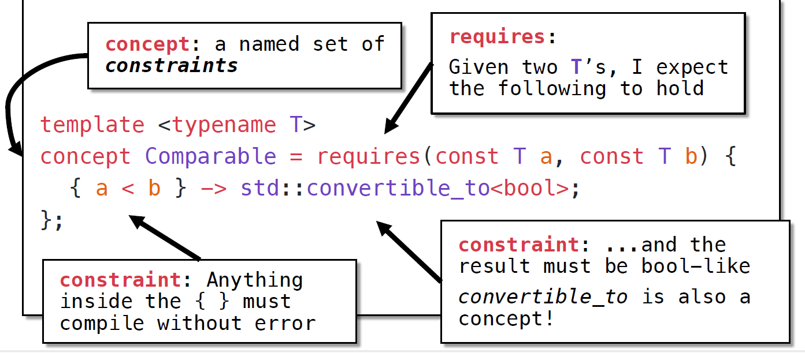
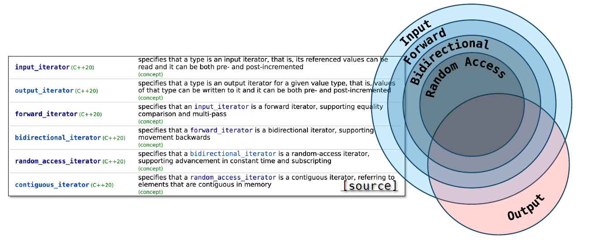
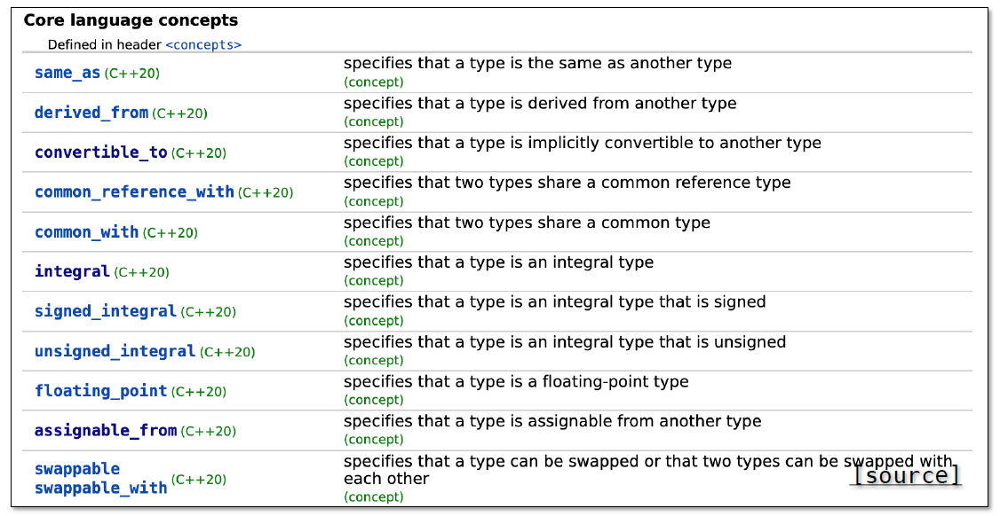
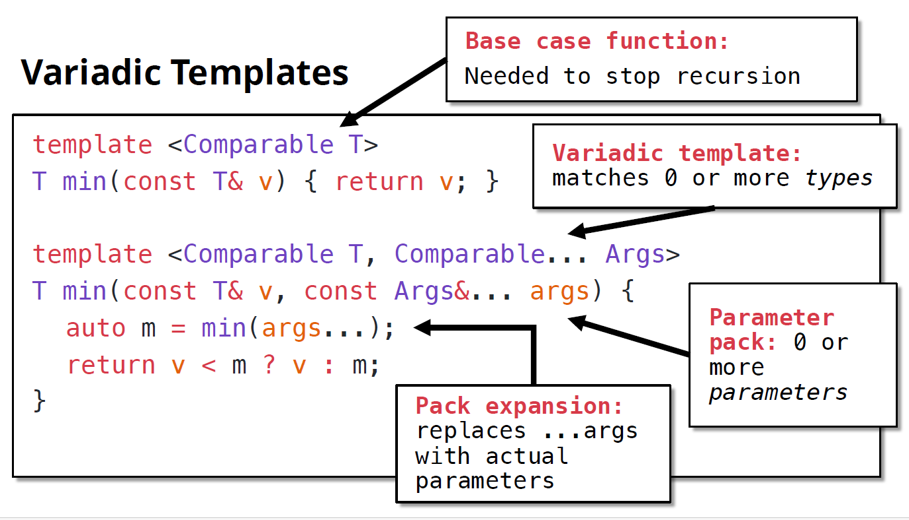
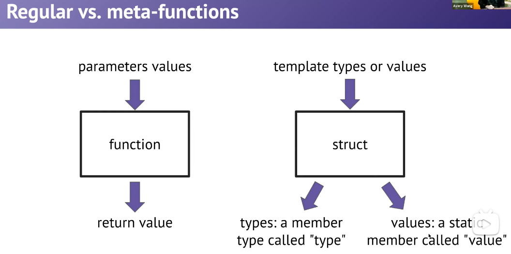

# Template Functions
## Template Functions
```cpp
template <typename T>
pair<T, T> my_minmax(T a, T b) {
    if (a < b)
        return {a, b};
    else
        return {b, a};
}

auto [a1, b1] = my_minmax<int>(2, 6); // 显式调用，在编译期间模板实例化；隐式调用，在运行期间实例化

auto [a2, b2] = my_minmax(2, 2.5); // 编译报错，my_minmax的入参必须数据类型一致

auto [a3, b3] = my_minmax("aaa", "bbb"); // 模板实例化化为C string，比较结果为非预期，比较的是地址而不是字符串本身

auto [a3, b3] = my_minmax<string>("aaa", "bbb"); // 模板实例化为string，比较字符串本身
```
## Concepts

```cpp
template <typename T>
concept Comparable = requires(T a, T b) {
    { a < b } -> std::convertible_to<bool>;
};

template <typename T> requires Comparable<T>
T min(const T& a, const T& b);

template <Comparable T>
T min(const T& a, const T& b);
```
* C++ comes with many built-in concepts.


```cpp
template <std::input_iterator It, Typename T>
It find(It begin, It end, const T& value) {
    for (auto it = begin; it != end; ++it) {
        if (*it == value)
            return it;
    }
    return end;
}
```
## Variadic Templates(可变参数模板)
```cpp
template <Comparable T>
T min(const T& v) {
    return v;
}

template <Comparable T, Comparable... Args>
T min(const T& v, const Args&... args) {
    auto m = min(args)
    return v < m ? v : m;
}
```

## Template MetaProgramming
```cpp
using S = int;
using cl_ref = const S&;
using result = std::remove_reference<cl_ref>::type;
constexpr bool equals = std::is_same<result, const int>::value;
```
### meta functions(元函数)
*  Meta-functions are structs that treats its template types/values as the parameters, and places the return values as public members.
*  We never need to create an instance of the struct.

```cpp
using K = identity<int>::type;

template <typename T>
struct identity {
    using type = T;
};

int val = identity<3>::value;

template <int V>
struct identity {
    static const int value = V;
};
```
### Template Deduction
* Template Specialization: you can have a generic template, as well as specialized templates for particular types.
```cpp
// generic
template <typename T>
class vector {

};

// specialized
template <>
class vector<bool> {

}
```
```cpp
bool diff = is_same<int, double>::value;
bool same = is_same<int, int>::value;

template <typename T, typename U>
struct is_same {
    static const bool value = false;
};

template <typename T>
struct is_same<T, T> {
    static const bool value = true;
};
```
```cpp
bool no = is_pointer<int>::value;
bool yes = is_pointer<int*>::value;

template <typename T>
struct is_pointer {
    static const bool value = false;
};

template <typename T>
struct is_pointer<T*> {
    static const bool value = true;
};
```
```cpp
using K = remove_const<int>::type;
using M = remove_const<const int>::type;

template <typename T>
struct remove_const {
    using type = T;
};

template <typename T>
struct remove_const<const T> {
    using type = T;
};
```
```cpp
template <> // this is a template specialization for N = 0
struct Factorial<0> {
    enum { value = 1 }; // enum: a way to store a compile-time constant
};

template <size_t N>
struct Factorial {
    enum { value = N * Factorial<N - 1>::value };
};

std::cout << Factorical<7>::value << endl; // compute at compile time
```
### constexpr
* `constexpr`: you can calculate this expression at compile-time. Stronger form of const.
* `if constexpr`: you can calculate the boolean at compile-time. Replace the entire `if/else` with the code that will actually be run.
```cpp
template <typename It>
size_t my_distance(It first, It last) {
    using category = typename std::iterator_traits<It>::iterator_category;
    if constexpr (std::is_same<category, std::random_access_iterator_tag>::value) {
        return last - first;
    } else {
        size_t result = 0;
        while (first != last) {
            ++first;
            ++result;
        }
        return result; 
    }
}
```
```cpp
// constexpr: dear compiler, please try to run me at compile time
constexpr size_t factorial(size_t n) {
    if (n == 0)
        return 1;
    return n * factorial(n - 1);
}

// consteval: dear compiler, you must run me at compile time
consteval size_t factorial(size_t n) {
    if (n == 0)
        return 1;
    return n * factorial(n - 1);
}
```
